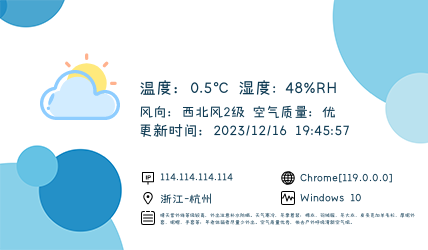

# weather-signature

#### 简介

一个基于express的天气签名图生成服务，可以让你在网站上显示自己的IP，操作系统，浏览器，当地天气。可以让你在网站上远程调用天气签名图，比如在网站侧栏/弹窗提醒等等...
##### img标签直接调用
```html

```
#### 演示效果




**<span style="color: #0c3952">真是一场酣畅淋漓的查看天气之旅啊！</span>**

#### 接口形式返回imgUrl

```html

```

##### 接口形式返回imgUrl
也可以通过接口方式返回JSON

```js
//发起请求
axios.get('http://localhost:4000?type=json')
```

```json
//返回数据
{
  "imgUrl": "xxx.xxx.png"
}
```

#### 技术栈   

- [node.js](https://nodejs.org/en/)
- [express](https://expressjs.com/)
- [天行api](https://www.tianapi.com/apiview/72) 


#### 注意事项

- 请在config.json中配置你的api key信息


#### 使用方法

把IP签名档添加到网站上，访客只需要打开你的网站就可以看到自己的IP，操作系统，浏览器，当地天气。

远程调用只需要将下面代码加到想显示的地方就行！比如网站侧栏/弹窗提醒等等...

```html

```

### 宝塔部署方法
1. 下载宝塔面板，安装好宝塔面板，然后登录到面板。
2. 点击左侧的软件管理，在软件管理中点击添加，选择上传安装包，上传weather-signature.tar.gz文件，点击确定。
3. 点击左侧的软件管理，在软件管理中找到weather-signature，点击进入。
4. 点击左侧的PHP，在PHP中点击添加，选择上传安装包，上传weather-signature.tar.gz

### 其他
[php版本](https://github.com/zenghongtu/weather-signature-php) 